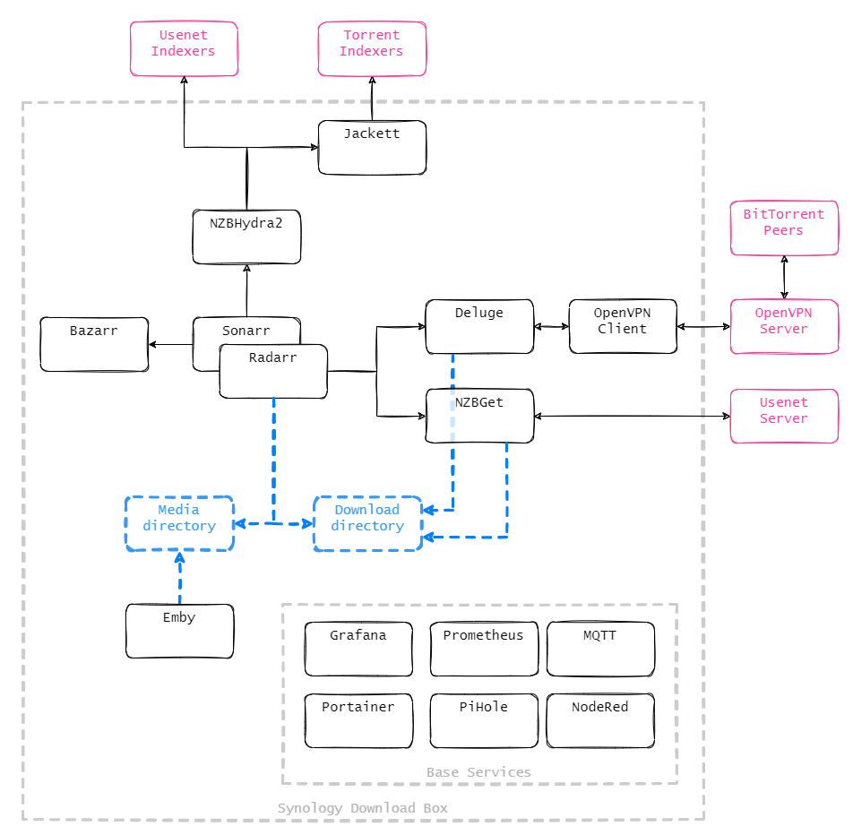

# Download-Box
A one-stop solution for downloading and managing movies and tvshows with docker

> [!CAUTION]
> This is currently getting a rework done, so don't use this branch unless you know what you are doing.

## Overview

## To Do
* ☑️ Initial commit
* ◼️ Clean up `docker-compose.yml`
* ◼️ Write manual on how to use this

# Manual
## Quick Start
Make sure you edit the `.env` file, so it suits your environment. After that you can bring this stack up by executing `docker-compose up -d`. Configs are not provided, so you have to manually configure all the software components.

If you are very new to all the tools, please check this [Installation Guide](https://github.com/sebgl/htpc-download-box#installation-guide) to get some help (and leave a star at that repo).

# FAQ
If you have any questions regarding this project, feel free to open up an issue and I'll gladly help you.

# Credits
Credits to @sebgl for the initial idea with his solution for HTPC computers (https://github.com/sebgl/htpc-download-box)
